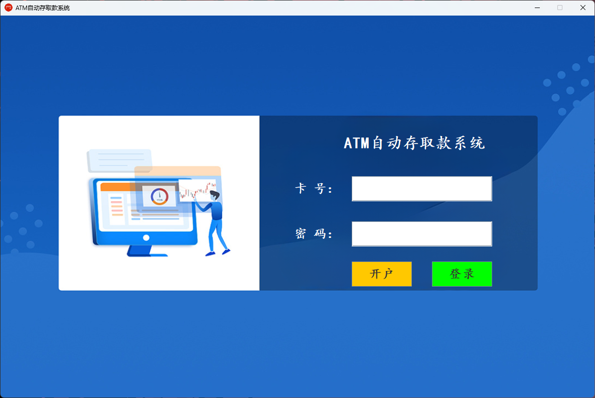
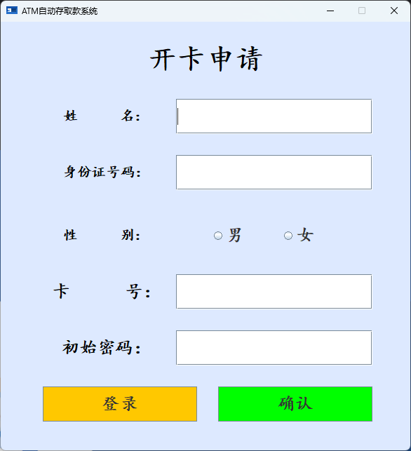
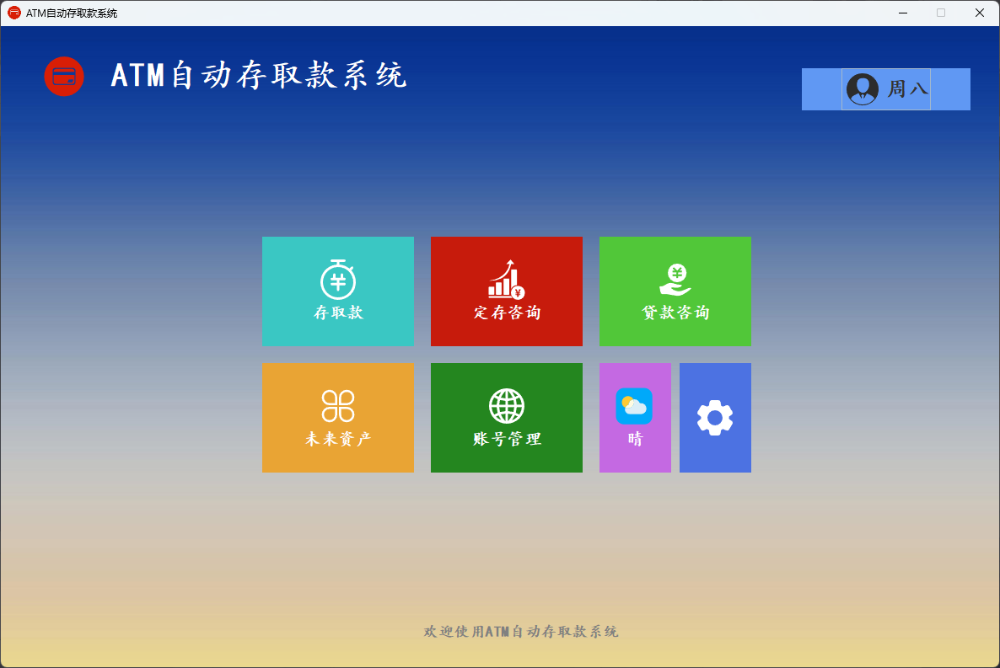
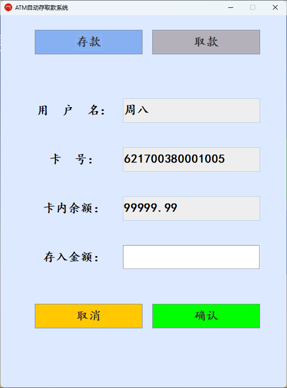
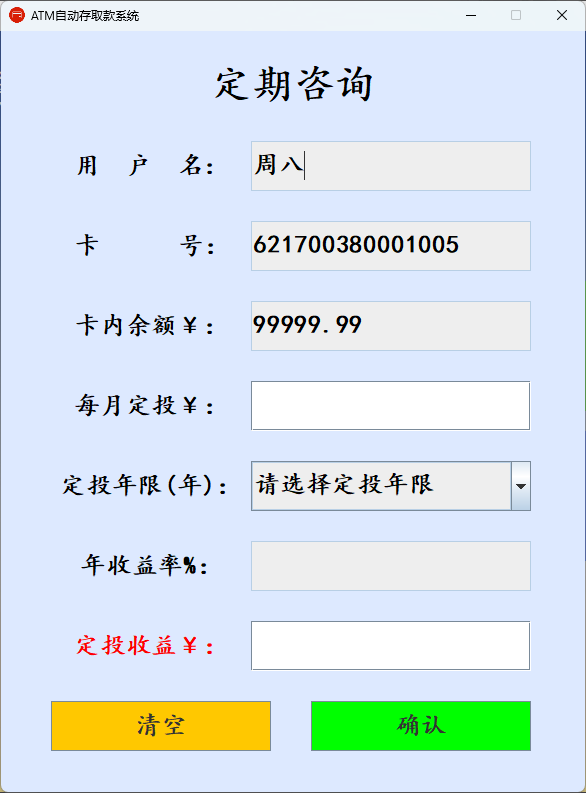
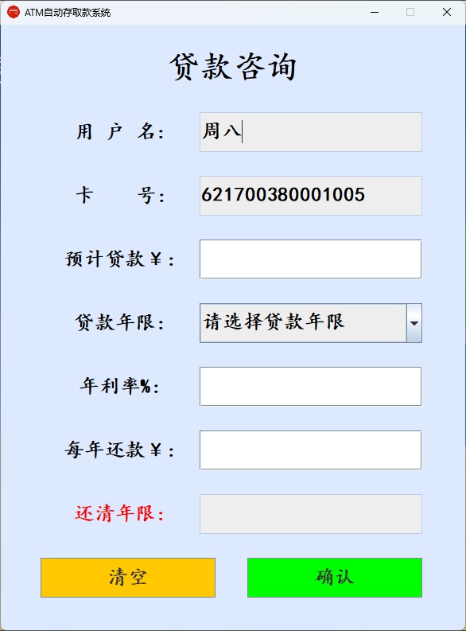
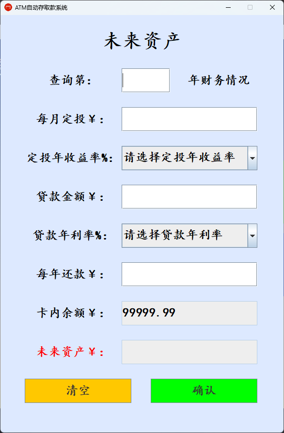

# ATM自动存取款系统

一个基于Java Swing开发的ATM模拟系统，具有用户开户、登录、存款、取款等功能。

## 项目简介

本项目是一个模拟ATM机操作的Java桌面应用程序。用户可以通过该系统进行开户、登录、存款、取款等基本银行业务操作。系统采用面向对象的设计思想，使用Swing组件构建图形用户界面，具备良好的用户体验。

## 功能特性

### 主要功能模块：

1. **用户开户**
   - 输入姓名、身份证号码、性别等信息完成开户
   - 自动生成15位银行卡号和默认密码(123456)

2. **用户登录**
   - 使用银行卡号和密码登录系统
   - 输入验证确保数据合法性

3. **主菜单功能**
   - 存取款操作
   - 定存咨询
   - 贷款咨询
   - 未来资产查询
   - 账号管理(待开发)
   - 其他功能(待开发)

4. **存款功能**
   - 支持存款操作
   - 实时更新账户余额

5. **取款功能**
   - 支持取款操作
   - 余额不足提醒

## 技术架构

- **编程语言**: Java
- **GUI框架**: Java Swing
- **设计模式**: 面向对象编程
- **项目结构**:
  ```
  src/
  ├── commons/       # 公共组件样式类
  ├── dao/           # 数据访问层
  ├── entity/        # 实体类
  ├── page/          # 界面页面
  ├── utils/         # 工具类
  └── images/        # 图片资源
  ```

## 类说明

### 实体类
- [Account.java](file:///D:/GitHub/HelloWorld/Java-Project/%E5%A4%A7%E4%B8%80%E4%B8%8B/ATM/src/edu/cdivtc/entity/Account.java): 银行账户实体类，包含卡号、密码、余额等属性
- [User.java](file:///D:/GitHub/HelloWorld/Java-Project/%E5%A4%A7%E4%B8%80%E4%B8%8B/ATM/src/edu/cdivtc/entity/User.java): 用户实体类，包含用户基本信息及账户列表

### 界面类
- [LoginFrame.java](file:///D:/GitHub/HelloWorld/Java-Project/%E5%A4%A7%E4%B8%80%E4%B8%8B/ATM/src/edu/cdivtc/commons/LoginFrame.java): 登录界面
- [RegisterFrame.java](file:///D:/GitHub/HelloWorld/Java-Project/%E5%A4%A7%E4%B8%80%E4%B8%8B/ATM/src/edu/cdivtc/page/RegisterFrame.java): 开户界面
- [MainFrame.java](file:///D:/GitHub/HelloWorld/Java-Project/%E5%A4%A7%E4%B8%80%E4%B8%8B/ATM/src/edu/cdivtc/page/MainFrame.java): 主功能界面
- [DepositWithdrawFrame.java](file:///D:/GitHub/HelloWorld/Java-Project/%E5%A4%A7%E4%B8%80%E4%B8%8B/ATM/src/edu/cdivtc/page/DepositWithdrawFrame.java): 存取款界面
- [FixedDepositFrame.java](file:///D:/GitHub/HelloWorld/Java-Project/%E5%A4%A7%E4%B8%80%E4%B8%8B/ATM/src/edu/cdivtc/page/FixedDepositFrame.java): 定存咨询界面
- [LoanFrame.java](file:///D:/GitHub/HelloWorld/Java-Project/%E5%A4%A7%E4%B8%80%E4%B8%8B/ATM/src/edu/cdivtc/page/LoanFrame.java): 贷款咨询界面
- [FutureAssetsFrame.java](file:///D:/GitHub/HelloWorld/Java-Project/%E5%A4%A7%E4%B8%80%E4%B8%8B/ATM/src/edu/cdivtc/page/FutureAssetsFrame.java): 未来资产查询界面

### 工具类
- [ComponentStyle.java](file:///D:/GitHub/HelloWorld/Java-Project/%E5%A4%A7%E4%B8%80%E4%B8%8B/ATM/src/edu/cdivtc/commons/ComponentStyle.java): 组件样式统一设置工具类
- [UserDao.java](file:///D:/GitHub/HelloWorld/Java-Project/%E5%A4%A7%E4%B8%80%E4%B8%8B/ATM/src/edu/cdivtc/dao/UserDao.java): 用户数据访问类
- [AccountDao.java](file:///D:/GitHub/HelloWorld/Java-Project/%E5%A4%A7%E4%B8%80%E4%B8%8B/ATM/src/edu/cdivtc/dao/AccountDao.java): 账户数据访问类
- [UserSaveTool.java](file:///D:/GitHub/HelloWorld/Java-Project/%E5%A4%A7%E4%B8%80%E4%B8%8B/ATM/src/edu/cdivtc/utils/UserSaveTool.java): 用户信息缓存工具类
- [ColorUtils.java](file:///D:/GitHub/HelloWorld/Java-Project/%E5%A4%A7%E4%B8%80%E4%B8%8B/ATM/src/edu/cdivtc/utils/ColorUtils.java): 颜色常量工具类
- [DbUtils.java](file:///D:/GitHub/HelloWorld/Java-Project/%E5%A4%A7%E4%B8%80%E4%B8%8B/ATM/src/edu/cdivtc/utils/DbUtils.java): 数据库连接工具类

## 运行环境

- Java 8 或更高版本
- 支持Swing的Java运行环境
- MySQL 5.7+ 或 MySQL 8.0+
- MySQL JDBC驱动（已内置在 `lib/mysql-connector-java-8.0.28.jar`）

## 数据库配置

### 1. 安装并启动 MySQL

确保本地 MySQL 服务已启动，默认端口 **3306**。

### 2. 初始化数据库

在 MySQL 中执行项目自带的初始化脚本：

```sql
source src/db/init.sql;
```

或直接在 MySQL 客户端中打开并运行 `src/db/init.sql` 文件。

脚本会依次完成：
1. 创建数据库 `db_atm_app`（字符集 utf8mb4）
2. 创建数据表 `db_account`（账户信息表）和 `db_user`（用户信息表）
3. 插入 **原始测试数据**（共 8 条账户/用户记录，仅供开发和测试使用）

### 3. 修改数据库连接配置

打开 `src/edu/cdivtc/utils/DbUtils.java`，根据你的 MySQL 配置修改连接信息：

```java
String url = "jdbc:mysql://127.0.0.1:3306/db_atm_app";
String username = "root";      // 改为你的数据库用户名
String password = "123456";    // 改为你的数据库密码
```

### 原始测试数据

初始化后可直接使用以下账号登录（所有测试数据均在 `src/db/init.sql` 中标注为 **原始测试数据**）：

| 用户名 | 卡号              | 密码   | 余额      |
|--------|-------------------|--------|-----------|
| 张三   | 621700380001000   | 123456 | ¥10,000   |
| 李四   | 621700380001001   | 123456 | ¥50,000   |
| 王五   | 621700380001002   | 123456 | ¥8,888.88 |
| 赵六   | 621700380001003   | 123456 | ¥200,000  |
| 孙七   | 621700380001004   | 666666 | ¥1,500.50 |
| 周八   | 621700380001005   | 123456 | ¥99,999.99|
| 吴九   | 621700380001006   | 123456 | ¥0.00     |
| 郑十   | 621700380001007   | 123456 | ¥350.00   |

### 数据库表结构

**db_account（账户表）**

| 字段          | 类型         | 说明                          |
|---------------|-------------|-------------------------------|
| cid           | INT (PK)    | 账户主键ID，自增               |
| accountNumber | VARCHAR(20) | 银行卡号（15位数字）            |
| password      | VARCHAR(20) | 登录密码，默认 123456           |
| money         | DOUBLE      | 账户余额，默认 0.0             |
| status        | INT         | 状态：1-正常，0-冻结，默认 1    |

**db_user（用户表）**

| 字段          | 类型         | 说明                          |
|---------------|-------------|-------------------------------|
| id            | INT (PK)    | 用户主键ID，自增               |
| username      | VARCHAR(50) | 姓名                          |
| identityCard  | VARCHAR(20) | 身份证号码                     |
| gender        | VARCHAR(10) | 性别                          |
| fk_cid        | INT (FK)    | 外键，关联 db_account.cid      |

## 如何运行

1. 克隆或下载本项目源代码
2. 参考上方 **数据库配置** 完成数据库初始化
3. 使用IntelliJ IDEA或其他Java IDE打开项目
4. 将 `lib/mysql-connector-java-8.0.28.jar` 添加到项目依赖中
5. 编译并运行[LoginFrame.java](file:///D:/GitHub/HelloWorld/Java-Project/%E5%A4%A7%E4%B8%80%E4%B8%8B/ATM/src/edu/cdivtc/page/LoginFrame.java)中的main方法启动程序
6. 在登录界面可选择开户或直接使用测试账号登录

## 使用说明

1. **开户流程**：
   - 点击登录界面的"开户"按钮进入开户界面
   - 填写姓名、身份证号码、选择性别
   - 点击"确认"按钮完成开户，系统会自动生成卡号和默认密码

2. **登录流程**：
   - 在登录界面输入15位银行卡号和密码
   - 默认密码为123456，可在开户后修改
   - 登录成功后进入主功能界面

3. **主要操作**：
   - 主界面提供多个功能选项，包括存取款、定存咨询等
   - 点击相应按钮即可进入对应功能界面

## 注意事项

- 本系统为模拟演示系统，不涉及真实银行业务
- 使用 MySQL 数据库持久化存储数据
- 卡号必须为15位数字
- 系统部分功能仍在开发中，标记为"暂未开通"

## 项目截图










## 许可证

---

## 📬 Contact Me | 联系我

如有问题、建议或合作交流，欢迎通过以下方式联系我：

[](mailto:absolutezero.cold200@simplelogin.com)

---

## 👤 Author | 作者信息
 
https://github.com/AbsoluteZero001  

本项目由本人独立开发与维护，主要用于 Java Swing + MySQL 学习与实践。

---

## ⚖️ Copyright | 著作权声明

© 2026 All Rights Reserved.  

本项目为原创学习项目，仅用于学习交流与技术研究目的。  
未经授权禁止用于商业用途、二次发布或剽窃行为。

如有引用或使用需求，请提前联系作者获得授权。

---

## 📌 项目说明补充

- 本项目遵循开源学习与技术交流原则
- 不涉及任何真实银行业务
- 数据均为模拟测试数据
- 欢迎 Fork 与学习